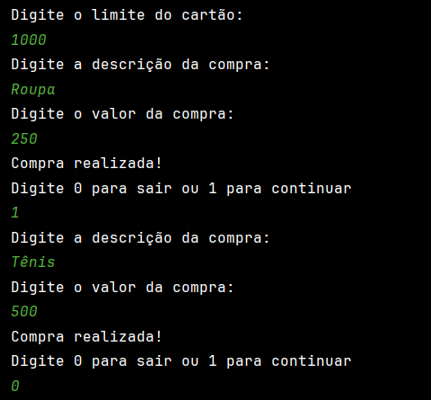
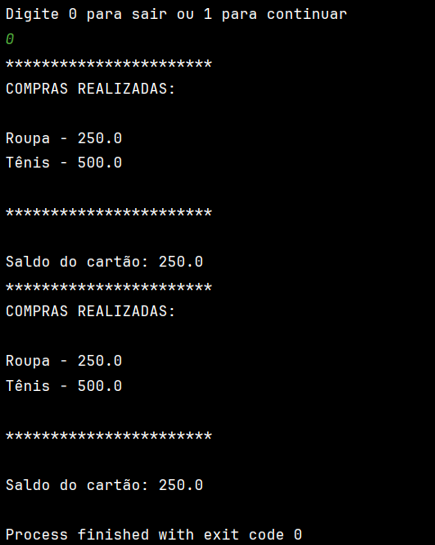
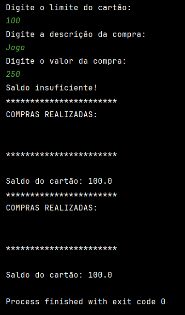

# Aplicação para prática de conhecimentos com Java.
## Resumo:
Aplicação com Java para praticar conhecimentos com orientação a objetos, listas, compareTo, herança e polimorfismo, interfaces.

## Executando a aplicação:
Os arquivos podem ser baixados localmente e executados por alguma IDE, preferencialmente no IntelliJ. A aplicação é executada via terminal.

## Exemplos da execução:
### Entrada de usuário:

### Saída após usuário digitar '0':

### Saída com condição de limite insuficente:
